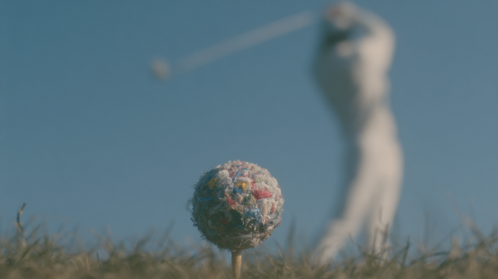

# 笔记 · 「垃圾高尔夫球」获奖图复盘（袋走行动·蚂蚁仰视击球前 0.1 秒）

> 入档：2026-06-22（补录；事件发生于 2026-05-18）
> 赛制：群内 morning prompt battle · 闪电战 · 同行互投 · 主题「袋走行动」
> 结果：**第一名**（本人作品，当场互投票数）
> 一句话：一颗压缩垃圾球伪装成高尔夫球放在球座上，用**蚂蚁仰视**把"被击打的弱者"字面化，定格在球杆击中前 0.1 秒——休闲的优雅暴力，玩的是我们丢弃的东西。
> 上位汇总：本图与同期两图共抽出 17 条方法论，见 [[获奖图复盘方法论合集_活合集]]。

---

## 获奖原图



> 蚂蚁仰视（worm's eye view），相机贴地仰拍：前景一颗高尔夫球大小、紧压成球的彩色塑料垃圾在球座上；上方挥杆者以极端低角度显得巨大、头部裁出画外，球杆在画面上方动态模糊斜切，**击中前一刻**。明亮蓝天，浅景深。

---

## 题面破局：尺寸保真 + 极端机位

本图同属「袋走行动」，走的是 **尺寸保真的视觉欺骗**（区别于松果的"同形撞类"）：
- 要让观众"看错"，被欺骗的物件必须**保持原型的尺寸+形态+位置**——高尔夫球大小、放在球座上、在该出现的地方。
- **只改变材质/构成**：自然/标准球 → 压缩塑料垃圾。
- 观众读取顺序：先认出"高尔夫球" → 再发现"是垃圾"。反例：做成巨大垃圾球就失去"高尔夫球"语义。

机位上选 **蚂蚁仰视**——闪电战里机位即态度：仰视=被压迫者/小生命视角，把"被击打的弱者"字面化。

---

## 完整获奖 prompt · 四层标注

> 图例：🟦 **叙事核心**（尺寸保真伪装）· 🟩 **风格基底** · 🟨 **机位/景深/动作层** · 🟥 **反讽收尾句**

```
Hyperrealistic cinematic photograph,                            🟩 超写实电影感基底
extreme worm's eye view, camera flat on the ground tilted
  sharply upward,                                               🟨 极端机位:蚂蚁仰视=弱者视角字面化
foreground: a golf ball sized sphere of tightly crushed
  plastic waste - bottles, caps, wrappers, bags - on a wooden
  tee, seen from below against bright clear sky,                🟦 尺寸保真:高尔夫球大小的垃圾球在球座上
vivid reds, blues, yellows, whites, and greens clearly visible, 🟨 垃圾的高饱和色:确保"读得出是垃圾"
towering above: a golfer shot from dramatic low angle,
  appearing enormous, head cropped out, only legs, torso,
  and arms visible,                                             🟦 巨大化挥杆者:压迫感+头裁出画外
caught at peak of downswing, club shaft slicing diagonally
  across upper frame in motion blur, about to strike,           🟨 进行时:击中前0.1秒(动作正在发生)
golfer clearly front lit, not silhouetted, crisp white attire, 🟨 正面打光:不要剪影,主体读得清
bright blue sky fills background,                               🟨 亮调蓝天:明亮强制
foreground grass blades towering and sharply lit,              🟨 前景草叶:仰视尺度感
shallow depth of field - trash ball and incoming club in
  sharp focus,                                                 🟨 浅景深:锁垃圾球+来袭球杆
vivid palette: sky blue, crisp green, white, vibrant plastic
  colors, bright midday sunlight, even illumination,            🟨 鲜明配色+正午均匀光
medium format film, fine grain,                                🟩 中画幅胶片/细颗粒
museum quality surreal photography                              🟩 美术馆级超现实摄影
- the elegant violence of leisure played with what we discarded 🟥 收尾句:休闲的优雅暴力,玩的是我们丢弃的
--ar 16:9 --raw --stylize 250
```

完整一行（可直接复制）：

```
Hyperrealistic cinematic photograph, extreme worm's eye view, camera flat on the ground tilted sharply upward. Foreground: a golf ball sized sphere of tightly crushed plastic waste - bottles, caps, wrappers, bags - on a wooden tee, seen from below against bright clear sky, vivid reds, blues, yellows, whites, and greens clearly visible. Towering above: a golfer shot from dramatic low angle, appearing enormous, head cropped out, only legs, torso, and arms visible, caught at peak of downswing, club shaft slicing diagonally across upper frame in motion blur, about to strike. Golfer clearly front lit, not silhouetted, crisp white attire. Bright blue sky fills background. Foreground grass blades towering and sharply lit. Shallow depth of field - trash ball and incoming club in sharp focus. Vivid palette: sky blue, crisp green, white, vibrant plastic colors. Bright midday sunlight, even illumination. Medium format film, fine grain. Museum quality surreal photography. The elegant violence of leisure played with what we discarded. --ar 16:9 --raw --stylize 250
```

---

## 图本身的赢点

1. **尺寸保真欺骗**：垃圾球保持高尔夫球的大小/形态/位置，只换材质——先认出球，再发现是垃圾。
2. **视角即态度**：蚂蚁仰视把"被击打的弱者"字面化，挥杆者巨大化+头裁出画外=压迫感。→ [[同行互投赛制的反主流原则]]（反主流机位）。
3. **动作正在发生**：`caught at peak of downswing ... about to strike`，击中前 0.1 秒，闪电战 0.5 秒决断里"卧槽等等"。
4. **亮度/对比强制**：正午亮调+正面打光+垃圾高饱和，确保 0.5 秒内读得出主体（与松果哑调走两条路殊途同归）。
5. **收尾句加固**：反讽集中在单一冲突，末尾 `the elegant violence of leisure played with what we discarded` 定情绪基调。

---

## 可固化方法论（本图贡献）

> 详细操作规则见上位汇总 [[获奖图复盘方法论合集_活合集]]，此处只列本图归属条目与验证级。

- **视觉欺骗的尺寸保真原则** ⭐⭐：被欺骗物保持原型尺寸/形态/位置，只改材质。
- **视角即态度的极端机位选择** ⭐⭐⭐：机位即观点，蚂蚁仰视=弱者视角字面化。
- **闪电战的"动作正在发生"原则**：进行时画面 > 完成时画面。
- **画面亮度强制律（正例）** ⭐⭐：本图为"亮调"正例，松果为"哑调"反例，共同修正为"高对比/读得出主体"。
- **反讽收尾句的四层压缩公式** ⭐⭐（与 [[2026-05-18_街道塑料袋家庭获奖图复盘]] 双场验证）。

---

## 下次改进

- 垃圾球的"高尔夫球"识别度依赖球座+尺寸，但某些种子下彩色过艳会先读成"糖果球"；下次可加一层白色高尔夫球表面暗示（如 `dimpled white golf ball surface partially showing through the compacted trash`）强化"球"的第一识别。
- 挥杆者可微调为更克制的白衣，避免与垃圾高饱和抢色。

---

## 关联文档

- 上位汇总：[[获奖图复盘方法论合集_活合集]]（本图归属 5 条方法论）· 历史版 [[获奖图复盘方法论合集_2026-05-18-19_v1]]
- 同期连胜：[[2026-05-18_街道塑料袋家庭获奖图复盘]]（同「袋走行动」Battle）· [[2026-05-19_松果手榴弹获奖图复盘]]
- 同脉方法论：[[同行互投赛制的反主流原则]] · [[复盘事实先行原则]]
