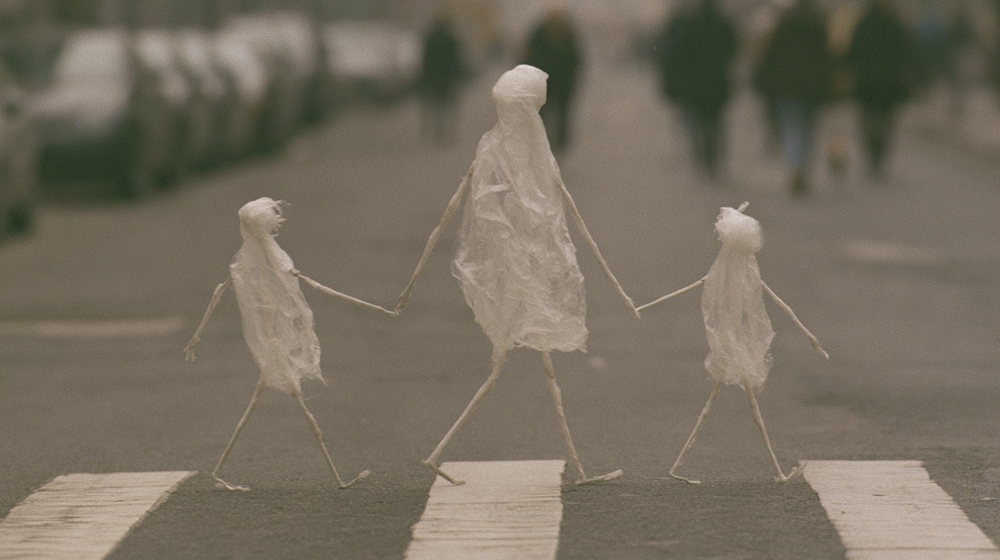

# 笔记 · 「街道塑料袋家庭」获奖图复盘（袋走行动·一家三口过马路）

> 入档：2026-06-22（补录；事件发生于 2026-05-18）
> 赛制：群内 morning prompt battle · 闪电战 · 同行互投 · 主题「袋走行动」
> 结果：**第一名**（本人作品，当场互投票数）
> 一句话：环保题不画"污染"，把塑料袋**家庭化**成一家三口手牵手过斑马线、真人只当模糊背景——谁才是街道的真正居民,一翻就赢。
> 上位汇总：本图与同期两图共抽出 17 条方法论，见 [[获奖图复盘方法论合集_活合集]]。

---

## 获奖原图



> 三个半透明塑料袋身体 + 细长棍状四肢，中间高、两侧矮，手牵手 mid-stride 横过白色斑马线；身后真人路人虚化、对它们**完全无视**。柔和阴天光，浅景深。

---

## 题面破局：「袋走行动」怎么翻译

题面字眼「袋」最主流的解读是"垃圾遍地的街道 / 塑料污染"——这条路撞车池最密，也最容易写成说教。

破局走 **语义反转**：不把塑料袋当"污染物"，而是反问"街道还能属于谁？"→ **塑料袋才是街道真正的居民**。主体从人类翻转为塑料袋，真人退成背景。一翻，题面从"环保议题"变成"我们的邻居"，情感重量瞬间到位。

→ 这条路属于同行互投最稳的获奖家族，见 [[同行互投赛制的反主流原则]]。

---

## 完整获奖 prompt · 四层标注

> 图例：🟦 **叙事核心**（家庭化翻转）· 🟩 **风格基底**（纪实摄影压住荒诞）· 🟨 **氛围/构图层** · 🟥 **反讽收尾句**

```
Hyperrealistic candid low angle street photograph:                🟩 纪实抓拍基底:把荒诞摁成"可信"
three anthropomorphic plastic shopping bags crossing a city
  zebra crossing like a small family,                            🟦 题眼:塑料袋"一家人"过马路
each figure has a translucent white crinkled plastic bag body,
  long thin spindly stick legs and arms, small head shape at top, 🟦 部件化拟物:身体=袋本身+分离肢体部件
one taller adult sized bag in the center holds hands with two
  smaller child sized bags on either side,                       🟦 家庭结构:一高两矮=父母子,情感杠杆
all mid stride moving left to right across white crosswalk stripes,🟨 进行时:正在过马路(动作发生中)
ordinary city street background with parked cars and blurred
  pedestrians completely ignoring them,                          🟦 反讽引擎:真人当背景且"完全无视"
soft overcast daylight, no harsh shadows,                        🟨 柔光阴天:不抢戏,纪实感
shallow depth of field with bag figures sharp and background
  in soft bokeh,                                                 🟨 浅景深:视线强制锁主体
restrained palette: translucent white plastic, warm pavement
  grey, muted urban tones,                                       🟨 克制配色:半透明白+暖灰
shot on medium format film, fine grain,                          🟩 中画幅胶片/细颗粒=美术馆质感
museum quality surreal street photography in the style of
  Erwin Wurm meets René Magritte                                 🟩 艺术家组合锚:Wurm(荒诞雕塑)×Magritte(超现实精神)
- the absurd everyday spectacle of those who own these streets now 🟥 收尾句:把情绪基调一句锁死
--ar 16:9
```

完整一行（可直接复制）：

```
Hyperrealistic candid low angle street photograph: three anthropomorphic plastic shopping bags crossing a city zebra crossing like a small family. Each figure has a translucent white crinkled plastic bag body, long thin spindly stick legs and arms, small head shape at top. One taller adult sized bag in the center holds hands with two smaller child sized bags on either side, all mid stride moving left to right across white crosswalk stripes. Ordinary city street background with parked cars and blurred pedestrians completely ignoring them. Soft overcast daylight, no harsh shadows, shallow depth of field with bag figures sharp and background in soft bokeh. Restrained palette: translucent white plastic, warm pavement grey, muted urban tones. Shot on medium format film, fine grain. Museum quality surreal street photography in the style of Erwin Wurm meets René Magritte - the absurd everyday spectacle of those who own these streets now. --ar 16:9
```

---

## 图本身的赢点

1. **主体翻转**：街道的"居民"从人类换成塑料袋，真人虚化退场——反向定义谁是主角，反讽锋利度的核心引擎。
2. **家庭化情感杠杆**：一高两矮、手牵手，"父母+孩子"结构让环保议题瞬间变成"我们的邻居"。
3. **背景完全无视**：`pedestrians completely ignoring them` 是日常化的关键句——越被忽视，越荒诞。→ 容器侧处理见 [[超现实主体的普通身体律]] 的互补面。
4. **部件化拟物**：身体=塑料袋本身 + 分离描述的细长四肢，而非笼统的 `a humanoid bag`；Erwin Wurm 是这类描述的最强艺术家锚。
5. **收尾句加固**：画面反讽集中在单一冲突上，末尾 `the absurd everyday spectacle of those who own these streets now` 给整张图定情绪基调。

---

## 可固化方法论（本图贡献）

> 详细操作规则见上位汇总 [[获奖图复盘方法论合集_活合集]]，此处只列本图的归属条目与验证级。

- **题面词汇的语义反转策略** ⭐⭐⭐：字面解读撞车，反向解读（街道→塑料袋是居民）跳出撞车池。
- **超现实的日常化原则** ⭐⭐⭐：荒诞主体（袋家庭）放进最日常容器（斑马线）+ 背景完全无视。
- **环保物件家庭化的情感杠杆** ⭐⭐⭐：环保符号家庭化/社会化，把"议题"翻成"邻居"，人类挪到背景。
- **反讽收尾句的四层压缩公式** ⭐⭐（与 [[2026-05-18_垃圾高尔夫球获奖图复盘]] 双场验证）。
- **半人形拟物的部件化描述法**：body as 物件 + 分离部件定位，避免整体形容词。
- **艺术家组合锚定法**：`Erwin Wurm meets René Magritte`，一个管形式、一个管精神。

---

## 下次改进

- 三袋的"头部"形状偏弱，第一眼略难读出"小孩"；下次可给孩子袋更明确的体量梯度或微小道具（如小书包形提手），强化"一家人"识别。
- 收尾句已奏效，但可测试更口语化的版本是否进一步提升投票共鸣。

---

## 关联文档

- 上位汇总：[[获奖图复盘方法论合集_活合集]]（本图归属 6 条方法论）· 历史版 [[获奖图复盘方法论合集_2026-05-18-19_v1]]
- 同期同赛：[[2026-05-18_垃圾高尔夫球获奖图复盘]]（同「袋走行动」Battle）· [[2026-05-19_松果手榴弹获奖图复盘]]
- 同脉方法论：[[同行互投赛制的反主流原则]] · [[超现实主体的普通身体律]] · [[复盘事实先行原则]]
