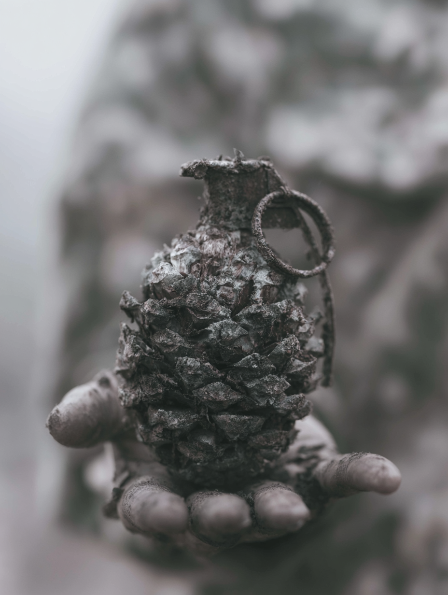

# 笔记 · 「松果手榴弹」获奖图复盘（同形撞类·士兵掌心）

> 入档：2026-06-22（补录；事件发生于 2026-05-19）
> 赛制：群内 morning prompt battle · 闪电战 · 同行互投
> 结果：**第一名**（本人作品，当场互投票数）
> 一句话：松果的轮廓本就像手榴弹——只在顶端缝一个**真实的保险栓+拉环**，一个物件同时是两样东西，0.4 秒的转译就是反讽。
> 上位汇总：本图与同期两图共抽出 17 条方法论，见 [[获奖图复盘方法论合集_活合集]]。

---

## 获奖原图



> 松果的鳞片质感保留，顶端无缝长出金属保险栓与拉环；托在一只脏污、灰白僵硬的手掌上；背景虚化成雾林冷灰。哑色调、高对比、极浅景深。

---

## 题面破局：用"同形撞类"而非"伪装"

本图的反讽结构不是"A 伪装成 B"，而是 **同形撞类**——一个物件**同时承载两种身份**：松果就是手榴弹，手榴弹就是松果。观众脑子需要 0.4 秒切换，这 0.4 秒就是反讽张力。

做法三步：
1. 先做**同形联想**——松果的轮廓还像什么？→ 手榴弹。
2. 选语义上完全不相干的撞形物（自然 vs 战争）。
3. **保留主体材质（松果鳞片），借用撞形物最具辨识度的单一部件（保险栓+拉环）**，无缝缝合而非叠加。

---

## 完整获奖 prompt · 四层标注

> 图例：🟦 **叙事核心**（同形撞类）· 🟩 **风格基底** · 🟨 **氛围/构图层** · 🟥 **承托手势/语义重力**

```
an extreme close-up of a pinecone shaped exactly like a
  military fragmentation grenade,                                🟦 题眼:松果=手榴弹(同形撞类)
dark bronze and gunmetal tones on the wooden scales,            🟦 跨物件错配:撞形物的颜色×主体物的材质
a real metal safety pin and lever fused seamlessly into the
  top of the cone,                                              🟦 身份触发器:单一道具(保险栓+拉环)无缝融合
resting on a soldier's dirty open palm,                         🟥 承托手势:脏污摊开的手=被捡到/被遗留
shallow depth of field with blurred camouflage uniform
  background,                                                   🟨 极浅景深+迷彩背景(后被MJ虚化成雾林)
harsh side lighting casting deep shadows between each scale,    🟨 硬侧光:压出鳞片立体=高对比
hyperrealistic photography style with sharp macro detail,       🟩 超写实微距:质感即说服力
muted cold palette of olive green, rust, and ash grey,          🟨 哑色冷调:克制反而高级
heavy atmosphere of dread and stillness,                       🟨 情绪:压抑与静止
war photojournalism aesthetic                                  🟩 战地纪实美学锚
--ar 3:4 --raw --stylize 300
```

完整一行（可直接复制）：

```
an extreme close-up of a pinecone shaped exactly like a military fragmentation grenade, dark bronze and gunmetal tones on the wooden scales, a real metal safety pin and lever fused seamlessly into the top of the cone, resting on a soldier's dirty open palm, shallow depth of field with blurred camouflage uniform background, harsh side lighting casting deep shadows between each scale, hyperrealistic photography style with sharp macro detail, muted cold palette of olive green, rust, and ash grey, heavy atmosphere of dread and stillness, war photojournalism aesthetic --ar 3:4 --raw --stylize 300
```

> 注意：本 prompt **没有反讽收尾句**仍获奖——因为画面反讽密度已爆表（松果+手榴弹+士兵手+雾林）。见下「赢点」第 5 条。

---

## 图本身的赢点

1. **同形撞类**：一个物件两种身份，不靠尺寸欺骗，靠轮廓共振——比"伪装"更狠。
2. **单一道具开关**：只加保险栓+拉环一个部件，成本极低、辨识度极高、张力极强；`fused seamlessly` 锁定融合而非叠加。
3. **材质×颜色跨物件错配**：`gunmetal tones on the wooden scales`——观众对颜色反应快于材质，先用颜色拐到手榴弹，再用材质拉回松果，0.4 秒差速就在这行。
4. **承托手势去生命化**：灰白僵硬的手把"士兵掌心的手榴弹"拉成"战争废墟里捡到的东西"——手的生命状态决定整图语义重力。
5. **收尾句省略边界**：画面反讽密度爆表时，收尾句反而冗余——**让画面比 prompt 更聪明**。
6. **哑色调反例**：本图以冷哑灰调获奖，证明获胜核心不是"亮"，而是"读得出主体"（高对比+极浅景深同样成立）。

---

## 可固化方法论（本图贡献）

> 详细操作规则见上位汇总 [[获奖图复盘方法论合集_活合集]]，此处只列本图归属条目与验证级。

- **同形撞类的视觉欺骗结构** ⭐⭐⭐：一个物件同时是两样东西（区别于"尺寸保真伪装"）。
- **材质与色彩的跨物件错配** ⭐⭐：`[撞形物色调] on the [主体物材质]`。
- **身份触发器·单一道具的语义开关** ⭐⭐：找撞形物最具辨识度的单一部件，无缝融合。
- **反讽收尾句的省略边界**：画面反讽爆表时省略收尾句。
- **极浅景深作为视觉强制** ⭐⭐：单一物件特写类题面通用。
- **承托手势的去生命化处理**：手的生命状态=语义重力开关。
- **画面对比度强制律（原"亮度强制律"修正）** ⭐⭐：本图作为反例，把"亮度律"修正成"高对比+焦点清晰"。
- **MJ 偏离即升级**：prompt 写 `camouflage uniform background`，MJ 渲染成虚化雾林——去掉露骨军事符号，反讽更锋利；偏离=升级而非缺陷。

---

## 下次改进

- 保险栓+拉环已是点睛，但金属与鳞片的接缝在某些种子下会略显"贴上去"；下次可加 `metal corroded to match the scale patina` 让融合更无缝。
- "同形撞类"待开发清单：贝壳⟷头盔 / 藕节⟷子弹带 / 玉米⟷弹药 / 洋葱⟷地雷——可复用本结构再战。

---

## 关联文档

- 上位汇总：[[获奖图复盘方法论合集_活合集]]（本图归属 8 条方法论）· 历史版 [[获奖图复盘方法论合集_2026-05-18-19_v1]]
- 同期连胜：[[2026-05-18_街道塑料袋家庭获奖图复盘]] · [[2026-05-18_垃圾高尔夫球获奖图复盘]]
- 同脉方法论：[[同行互投赛制的反主流原则]] · [[复盘事实先行原则]]（MJ偏离即升级的互补面）
