# Flova AI 简单使用教程

> 面向刚入手 Flova AI 的同学:讲清工具用法与特点,并完整走一遍「想法 → 成片」的流程。
> 本期成品是一支**伪纪录片**——以旁白视角讲《山海经·西山经》的地貌与异兽。
>
> 归档说明:本教程原始交付件含成片、7 段分镜视频与 2 条音频(共约 273MB),
> 按知识库「只存方法、不存素材」的规则,**视频与音频未入库**,正文以文字标注替代;
> 界面截图与资产图完整保留在 `assets/`。

---

## 一、成品展示

成品为一支约 1 分钟的伪纪录片:黑屏淡入 → 云海俯冲进华山山脉 → 西行跨越 → 猨翼之山 → 白玉危岩 → 异兽「猨」现身 → 特写锐爪 → 神话总结,全片旁白 + 苍凉骨笛配乐。

> 📼 成片文件《第二版.mp4》未入库(97MB)。

---

## 二、软件介绍

- Flova 是一个 AI 原生的视频创作 Agent 平台。集成了主流的图像、音乐、视频生成模型,以及用于理解与调度的语言模型。你可以用自然语言表达创作诉求,也可以上传文本、图片、视频或音频作为参考;接下来由 Agent 在多步规划与执行中,把项目从构思推进到成片。这个过程覆盖剧本创作、分镜设计、图片 / 视频 / 音频生成,以及剪辑时间线组装;Agent 会持续根据你的反馈调整,直到得到最终视频。

- 使用地址:https://flova.tv/zh-CN/


---

## 三、制作流程

本视频从想方法到视频片段由 Flova AI 完成,剪映负责后期修改。

### 剧本制作

- 打开 Flova AI 输入你的想法,他会按照你的想法给出剧本。

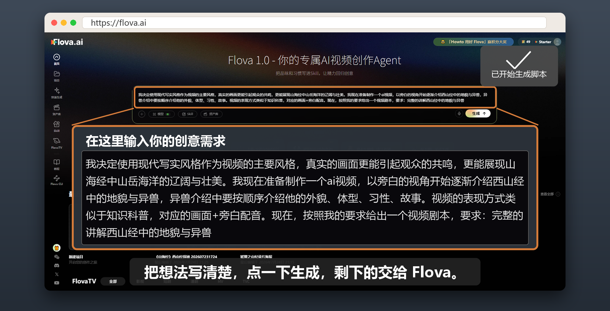

```text
我决定使用现代写实风格作为视频的主要风格,真实的画面更能引起观众的共鸣,更能展现山海经中山岳海洋的辽阔与壮美。我现在准备制作一个ai视频,以旁白的视角开始逐渐介绍西山经中的地貌与异兽,异兽介绍中要按顺序介绍他的外貌、体型、习性、故事。视频的表现方式类似于知识科普,对应的画面+旁白配音。现在,按照我的要求给出一个视频剧本,要求:完整的讲解西山经中的地貌与异兽
```

- 得到剧本(**由于得到的剧本内容过多,我们先制作第一幕猨翼之山**)

```text
(视频开始)
【画面】
黑屏淡入。一声悠远、苍凉的骨笛声响起。
镜头从翻滚的云海上方急速下坠,穿过云层。下方,一条如巨龙般蜿蜒的白色山脉赫然出现,山峰如刀削斧劈,覆盖着皑皑白雪。这就是华山山脉。镜头高速掠过险峻的山脊,能清晰看到岩石的纹理和绝壁上的松柏。
【旁白】
"西山经,是《山海经》中神话与奇兽最为密集的篇章。它起于东方的华山,一路向西,跨越崇山峻岭,最终抵达传说中众神所居的昆仑之丘。今天,我们将沿着这条古老的路线,去探寻那些隐藏于巍巍山岳间的真实地貌,以及那些足以挑战我们认知极限的异兽。"
第一幕:西次一经·猨翼之山
【画面】
镜头推近一座奇特的山峰。山上几乎没有高大的乔木,而是布满了倒悬的、如尖刀般锋利的白色岩石,在阳光下闪着寒光。镜头特写一处悬崖,许多似猿非猿的生物在岩石间攀援跳跃,它们的动作极其敏捷,但偶尔会有碎石掉落深渊,久久听不到回响。镜头给到一只生物的手脚特写,可以看到它长着类似人类的指甲,但更尖利、厚实。
【旁白】
"我们的第一站,是西次一经中的第一座山,名为猨翼之山。地如其名,这里悬崖峭壁,险峻异常,是猿猴也无法攀越的绝境。山中多产白玉,但山下则遍布着随时可能坠落的危岩。"
"此山的原住民,是一种名为猨的异兽。其状如禺,也就是我们熟悉的猿猴,但它们生有白色的耳朵,能以四肢匍匐行走,也能如人一般直立。它们的指甲尖锐如钩,是它们在山岩间闪转腾挪的利器。《山海经》记载,食其肉,可使人健步如飞。这种特性,或许是古人对它们超凡攀援能力的某种崇拜与想象。"
```

### 制作资产

- 在 Flova AI 给出剧本后,他会让你选择下一步要做什么,可以选择选项,也可以输入自己的想法,**这里我是输入的自己想法。**

```text
以上是一个介绍西山经的视频剧本,视频整体表现形式与纪律片类似,使用画面结合旁白的表现形式。根据该剧本制作视频分镜脚本,严格把控每个镜头的时长和镜头的设计。并给出其中涉及场景、生物的形象提示词,画幅比例为16:9
```

- 此时他会自动运行默认的「**剧本生视频**」工作流,对新人友好。

Flova AI 的技能工作流(skills)会在后面详细讲解。

- 此时 Flova AI 会给出资产提示词和视频分镜。**然后会让我们选择下一步要做什么,制作视频图片资产还是分镜提示词。(无论选择哪一项,都不影响视频制作)我这边选择了先制作 prompt 草稿。得到资产提示词。**

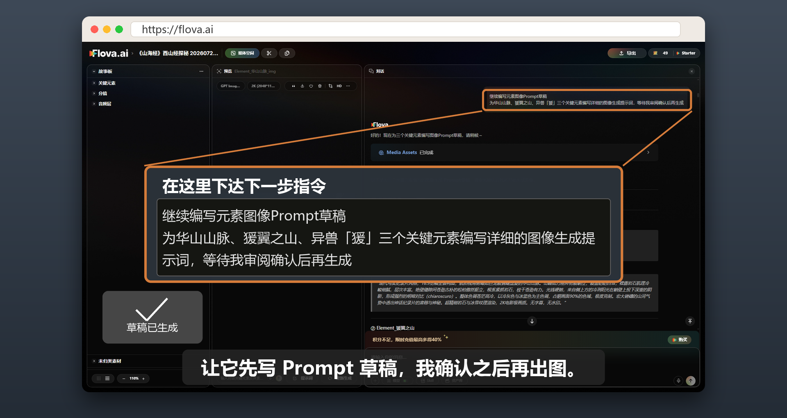

```text
现代写实纪录片风格,16:9宽幅全景构图,航拍视角俯瞰如巨龙般蜿蜒盘旋的华山山脉。山峰如刀削斧劈般峭立,覆盖皑皑白雪,裸露岩石肌理冷峻细腻,层次丰富。绝壁缝隙间苍劲古朴的松柏傲然挺立,根系紧抓岩石,枝干苍劲有力。光线硬朗,来自侧上方的冷冽阳光在峭壁上投下深重的阴影,形成强烈的明暗对比(chiaroscuro)。整体色调苍茫高冷,以冷灰色与冰蓝色为主色调,占据画面90%的色域,极度克制。宏大磅礴的山河气势中透出神话纪录片的肃穆与神秘。超精细岩石与冰雪纹理渲染,2K电影级画质。无字幕,无水印
```

```text
现代写实纪录片风格,16:9宽幅构图,呈现猨翼之山这座极具异界感的险峻山峰。整座山体几乎没有任何高大乔木,全貌尽显其荒诞诡异的裸岩地貌。山体表面密布大量倒悬的、如尖刀般锋利的白色岩石,其为白玉矿床所构成,在强烈的直射阳光下折射出冷冽刺目的寒光。悬崖之上叠压着随时可能坍塌的巨大危岩,给人以压迫性的危机感(oppressive stillness)。悬崖之下是深不见底的迷雾深渊,云雾翻腾,吞噬一切,令人不寒而栗。仰角低机位构图,强调山体的极端垂直感与压迫感。整体色调冷峻苍白,以冰冷的白色、灰蓝色为主导色,带有一丝诡异的异界光泽。超精细岩石纹理与光影渲染,2K电影级画质。无字幕,无水印
```

```text
现代写实自然纪录片风格,结合神话异兽质感,16:9横向角色多视图参考图。画面从左至右横向排列:最左侧为一张半身特写肖像,右侧依次为正面全身图、侧面全身图、背面全身图,共四视图,背景为干净中性的浅灰色岩石质感工作室背景。
角色描述——异兽「猨」:体型如健硕成年雄性灵长类,肌肉发达、身形壮实,浑身覆盖着深灰色的粗糙厚实毛发,毛发纹理细腻写实。最显著特征为一对纯白色的大耳朵,在深灰色毛发衬托下极为醒目。面部具有高度写实的灵长类动物特征:深邃机警的眼神,鼻梁宽厚,口吻突出,结构写实,带有神话异兽的独特气质(predatory stillness)。手部与脚部的指甲厚实坚硬,形如铁钩、弯钩状,呈深褐色,专为扣抓锋利岩壁而生。整体风格融合BBC自然纪录片的写实质感与《山海经》神话插图的异兽神韵,精细高质量渲染,细节丰富。无字幕,无水印
```

这边制作的是一个伪纪录片,对关键帧和参考要求不高,制作其他类型视频时推荐告诉 Flova AI,给出每个镜头的关键帧,在制作形象图后优先根据形象图制作关键帧。

Flova AI 所默认的资产提示词制作 skills,会主动在资产提示词后面增加常用负面提示词,以及人物形象制作时直接提供四视图,帮助新人保持人物一致性。

**Flova AI 在制作图片、视频、音频时如果规定使用哪一个模型,Flova AI 会默认使用所用 skills 中指定的模型。**

- 资产提示词检查无误后让 Flova AI 制作形象图片,得到资产图。

- **猨**

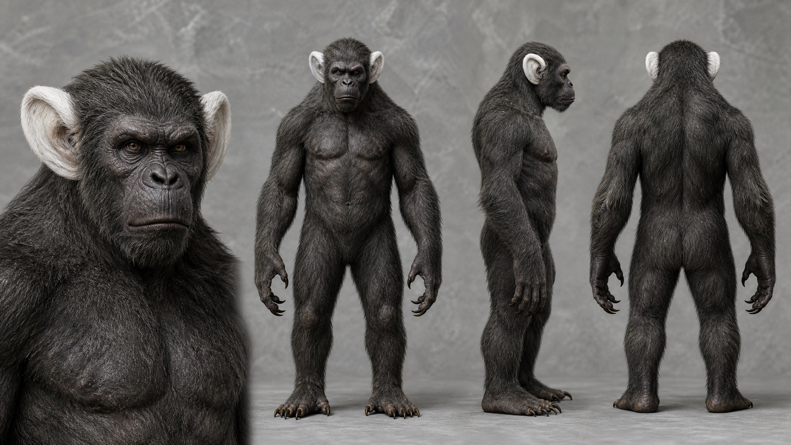

- **猨翼之山**

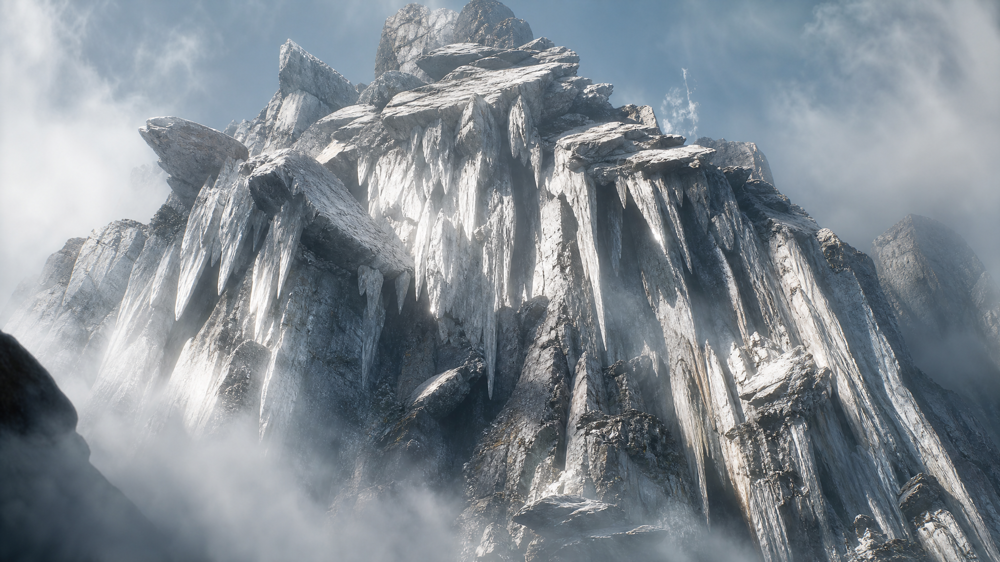

- **华山山脉**

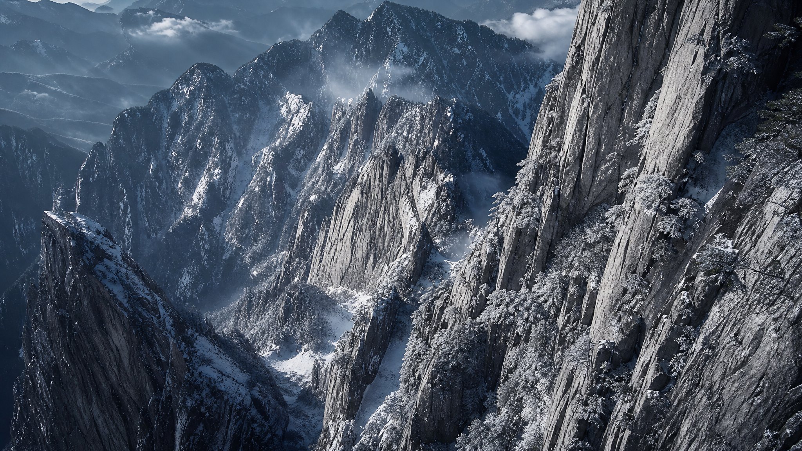

### 视频分镜提示词与视频制作

#### (1)分镜提示词制作

- 在前面两步我们完成了剧本与所需资产的制作,这一步来让 Flova AI 制作分镜提示词。

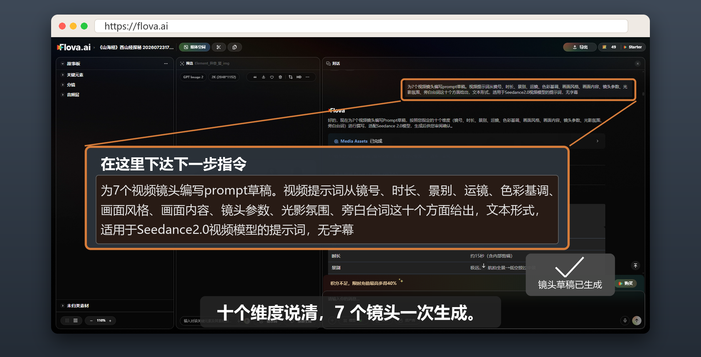

```text
为7个视频镜头编写prompt草稿。视频提示词从镜号、时长、景别、运镜、色彩基调、画面风格、画面内容、镜头参数、光影氛围、旁白台词这十个方面给出,文本形式,适用于Seedance2.0视频模型的提示词,无字幕
```

- 得到七个分镜提示词

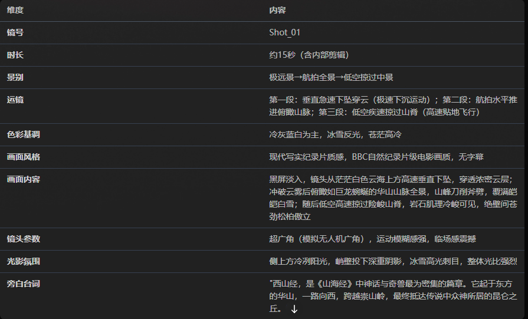

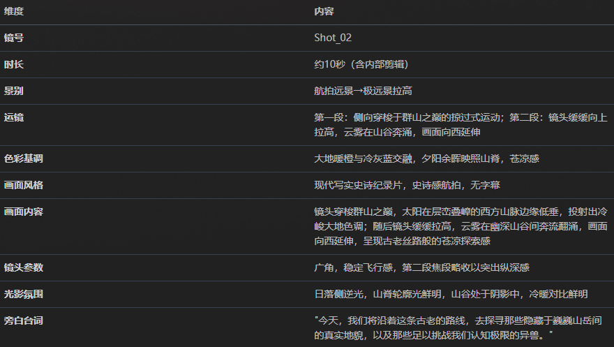

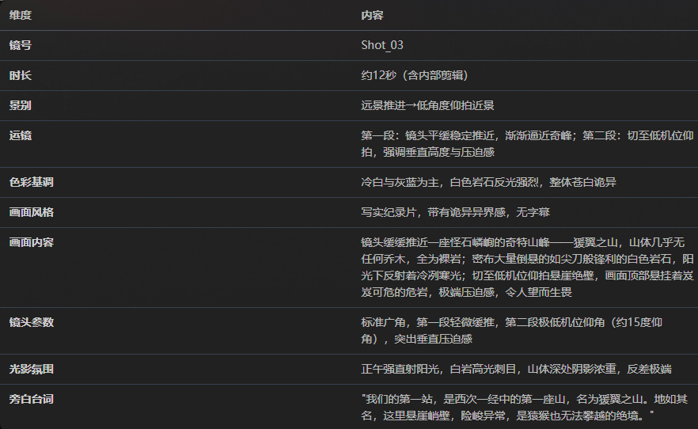

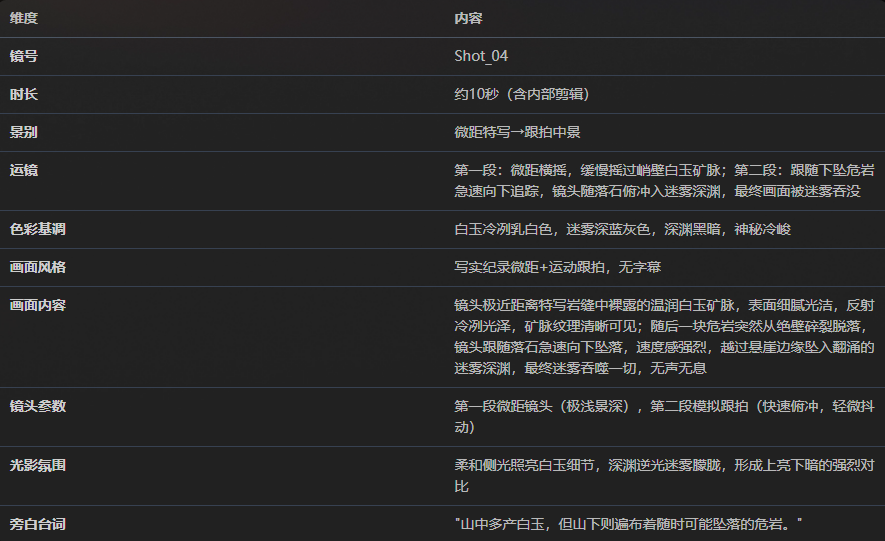

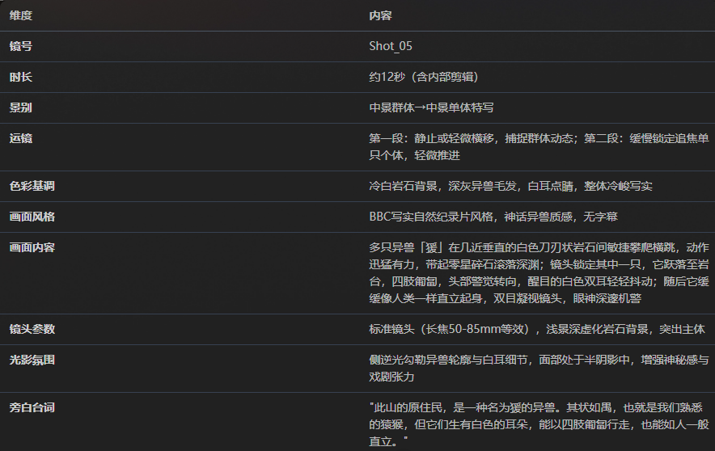

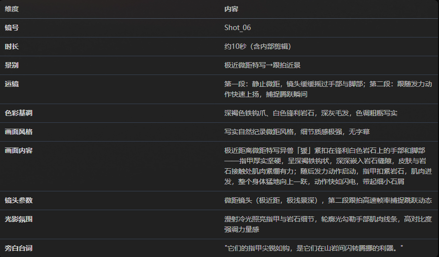

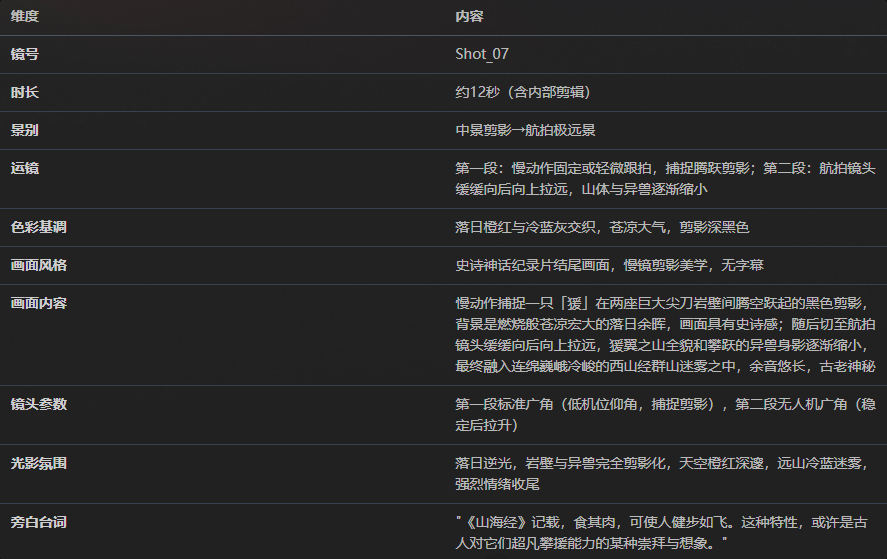

#### (2)视频制作

- 在分镜提示词制作完成后,Flova AI 会问你是先制作一个片段还是所有片段。先检查分镜提示词无误且符合自己要求,然后制作一个片段(**先制作一个片段查看效果,以免不必要的浪费**)。

- 观看一个片段的风格和表现,是否符合预期,满意后告诉 Flova AI 制作下一个片段。得到后面六个片段。

七个分镜片段(视频文件未入库):

| 镜号 | 片段 | 原始文件名 |
|---|---|---|
| Shot 01 | 片头·云海俯冲与华山全景 | `flova_Shot_片头_云海俯冲与华山全景_video_202607231744_85d30f.mp4` |
| Shot 02 | 片头·西行跨越 | `flova_Shot_片头_西行跨越_video_202607231800_d01c02.mp4` |
| Shot 03 | 第一幕·接近猨翼之山 | `flova_Shot_第一幕_接近猨翼之山_video_202607231800_c8a8a6.mp4` |
| Shot 04 | 第一幕·白玉危岩 | `flova_Shot_第一幕_白玉危岩_202607231800_7bb0ca.mp4` |
| Shot 05 | 第一幕·异兽猨现身 | `flova_Shot_第一幕_异兽猨现身_202607231855_662c0d.mp4` |
| Shot 06 | 第一幕·特写锐爪 | `flova_Shot_第一幕_特写锐爪_202607231800_2eac02.mp4` |
| Shot 07 | 第一幕·神话总结 | `flova_Shot_第一幕_神话总结_202607231808_99f5d4.mp4` |

### 制作旁白配音与背景音乐

- Flova AI 的旁白和音频是在视频完成后制作的(也**可以在提示词中要求音画同出**)。

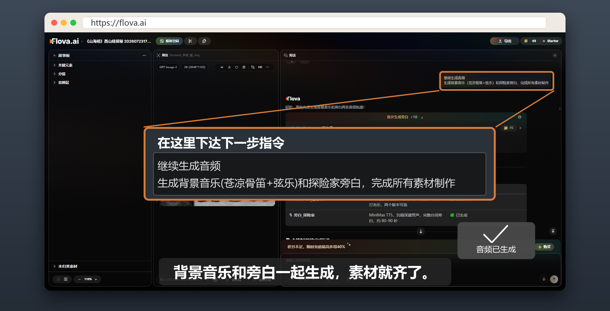

得到配乐与旁白(音频文件未入库):

- 旁白·探险家 —— `flova_Audio_旁白_探险家_202607231902_b4efd4.mp3`
- 背景音乐·苍凉骨笛 —— `flova_Audio_背景音乐_苍凉骨笛_202607231902_13fe75.mp3`

### 后期剪辑

教程中使用 Flova AI 的自动剪辑功能进行后处理。有剪辑功底的同学可以使用其他软件进行。

- 配音与旁白制作完成后,确认无误,选择「**直接合成最终视频**」选项,即可让 Flova AI 开始剪辑视频。


- 得到成品(**可以在该界面对视频进行部分调整**)

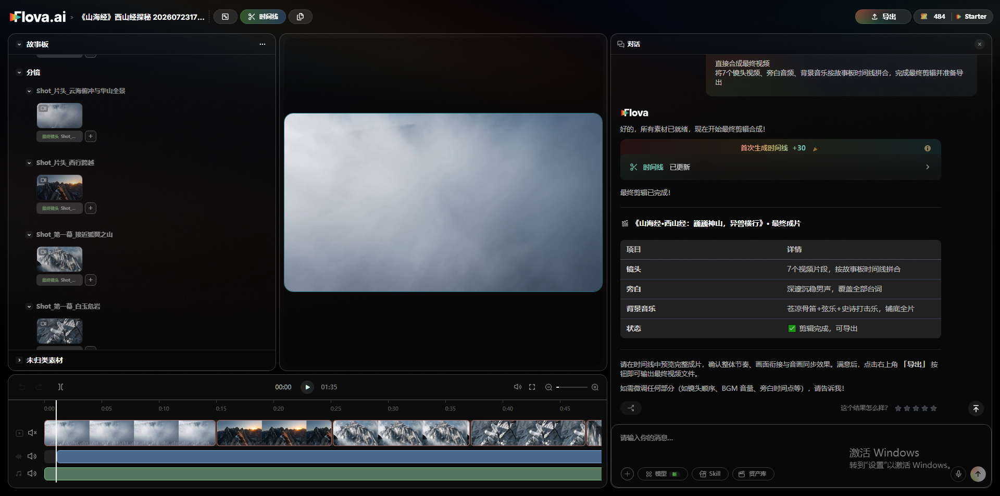

- 根据自己的要求对视频微调后得到终版。

---

## 四、自带 skills 模块讲解

- Flova AI 的 skill 模块内含多种技能,可以帮助创作者在视频制作时找寻灵感,帮助刚开始接触 AI 视频的同学进行视频制作。

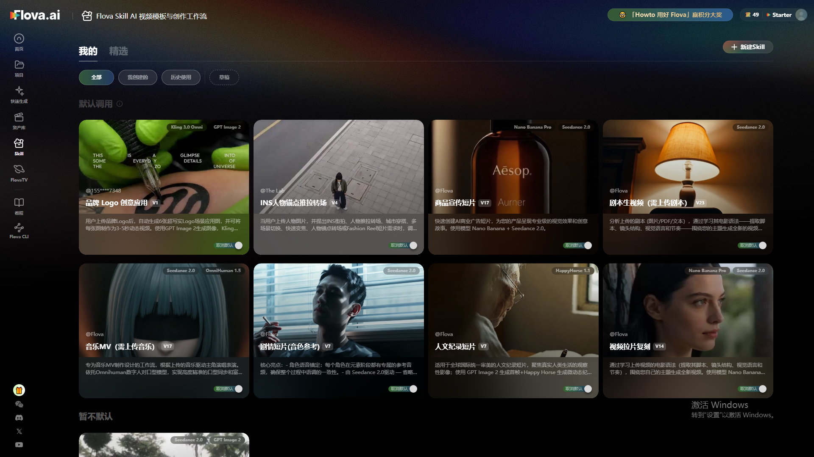

- 当 skill 中没有自己需要的 skill 时还可以根据自己的需要进行定制,选择新建 skill,输入你的想法,Flova AI 的智能体会帮助你完成专属 skill 的制作。

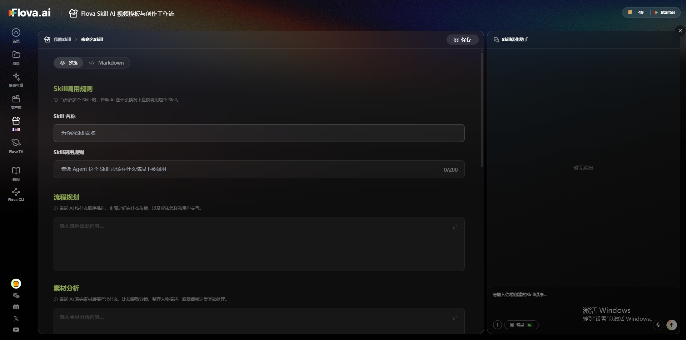

---

## 五、总结

### Flova AI 适合哪些人群

**个人爱好者**

- AI 视频新手尝试不同模型效果,学习从想法到成片的完整流程
- 独立创作者制作 AI 短片、音乐 MV、社媒视频或兴趣向作品

**品牌、营销与商业创作者**

- 小品牌、卖家制作产品展示、广告片或活动预告
- 营销人员制作 campaign 视频、竖屏广告和多版本创意素材
- 内容团队用有限素材快速生成、对比和迭代不同视频方向

**AI 影像创作者与专业制作团队**

- AI 短片、短剧专业团队的创作者,需要持续打磨角色、分镜和镜头表现
- 使用 AI 制作广告、商用短片从业者,需要在项目周期内稳定产出符合品牌要求的视频内容

### 用 Flova 能做什么

Flova 支持多种 AI 视频与影像内容创作,从早期灵感探索到完整成片都可以在项目里推进。

- AI 短片与短剧:原创短片、连续剧情、微短剧和角色驱动的故事内容
- 音乐与情绪向视频:音乐 MV、情绪片、氛围短片和视觉类内容
- 广告与营销视频:品牌广告、活动预告、促销 campaign、产品展示和卖点讲解视频
- 社媒与竖屏内容:口播讲解、热点短视频、账号内容和适合社交平台发布的视频
- 素材探索与单点生成:风格探索图、角色设定、氛围板、单个 AI 镜头和图片素材
- 半成品补充与组接:已有实拍、粗剪或外部素材项目中的镜头补充、片段生成和成片组接

### Flova 的特点

- 一个目标下的视频创作往往是连续且长时间的,过程中会留下多次取舍的各种资产,中间产物越积越多。Flova 是按「可延续的创作过程」来设计他的记忆系统,他能了解你的这次目标里的创作过程和当前状态,来推进创作持续进行。

#### (1)有序规划

- 复杂的视频创作任务里很多环节前后衔接,后面的环节会依赖前面已经定下来的结果。Flova 会结合项目结构理解这些依赖,规划先后顺序,让后置生成建立在你已选定的前置成果上,而不是各步孤立进行。每个中间环节都可以生成多个版本,方便你对比和挑选;选定或修改之后,后续规划会在你当前这一版上继续执行。通过多轮迭代、前后依赖和过程里的版本管理,整条链路更可追踪、更可调整,整体结果也更可控。

#### (2)你的判断会被记住

- 对于过程资产的反复创作,你的意见、你的修改、最终选定等行为都会被写进项目上下文,并有结构的组织。后续生成会记住你的偏好,而不必反复解释「要刚才那种感觉」。执行类工作(素材整理、时间线组装、调用模型等)由 Agent 推进;故事往哪走、关键镜头用哪一版,由你决定。

#### (3)创作流程灵活

- 一个目标下的视频创作往往是连续且长时间的,过程中会留下多次取舍的各种资产,中间产物越积越多。Flova 是按「可延续的创作过程」来设计他的记忆系统,他能了解你的这次目标里的创作过程和当前状态,来推进创作持续进行。

---

## 素材归档说明

原始交付件 `Flova ai简单使用教程.zip`(273MB,2026-07-27)含本教程全部视频与音频。按知识库规则,以下文件**未入库**,保存在本地:

- 成片 `第二版.mp4`(97MB,zip 内有两份完全相同的副本)
- 7 段分镜 mp4(共约 51MB)
- 2 条音频 mp3(共约 5.9MB)

入库部分:本文档 + `assets/` 下 19 张界面截图与资产图(约 21MB)。
