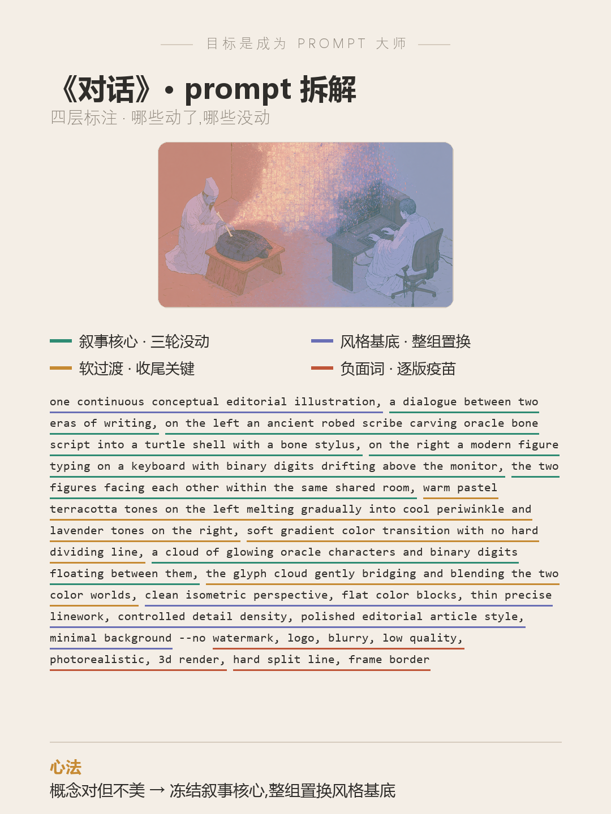

# 目标是成为 Prompt 大师 · 第 1 期《对话》

> 封版:v1.0 · 2026-06-17
> 这是一篇可以单独阅读的笔记,不需要任何前置知识。看不懂的词,文末有「名词小抄」。

---

## 先说背景:这是个什么比赛

prompt battle 是一种「同题作画」比赛:主办方出一个主题词,所有人用同一类 AI 画图工具(这次用的是 Midjourney,圈里简称 MJ),比谁的图把主题表达得更准、更巧。

这一期的主题只有两个字——**对话**。

难点在哪?像「对话」这种很**抽象**的词,几乎所有人的第一反应都是「画两个人面对面说话」。结果就是大家的图长得差不多,谁也不出彩。圈里管这个叫**撞车**。

这篇笔记拆的,就是一张**没撞车**的《对话》:它是怎么想出来的、prompt 怎么写、又改了三版才定稿。


---

## 一、破题:把「对话」翻译成一张画面

抽象的词没法直接画,得先「翻译」成具体的画面。这张图的翻译分四步:

1. **拆开「对话」的本质**
   对话 = 两个角色 + 信息在他们之间来回流动。先抓住这个骨架,而不是急着画「嘴」。

2. **换掉「两个人」这个老套主角**
   把对话双方,换成**两个时代的文字**:最古老的**甲骨文**,和最新的**二进制**(也就是电脑里那串 0 和 1)。这俩看着天差地别,但本质是同一件事——人类在记录信息。

3. **让他们做「同一个动作」**
   左边,一位古代书吏跪坐着,用骨头在龟甲上刻字;右边,一个现代人坐在工位敲键盘。三千年过去了,动作其实没变:都是**书写**。
   一古一今、相隔三千年,却在做同一个动作——这种「咦,原来是一回事」的顿悟感,就是这张图打动人的地方。

4. **把「对话」本身画出来**
   两边升起的文字,在画面正上方汇成一团发光的「字符云」。这团云,就是他们**对话的内容**。

**一句话总结**:这张图里没有任何人在「说话」,但**整张图的结构**就是一场对话——
左右两个人 = 对话双方;中间的字符云 = 对话内容;左暖色、右冷色慢慢融到一起 = 互相听懂了。

> 这就是抽象主题最有用的一招:**别画字面意思,去画「关系的结构」。**

---

## 二、完整 prompt(可以直接抄)

```
one continuous conceptual editorial illustration, a dialogue between two eras of writing, on the left an ancient robed scribe seated at a low wooden table carving oracle bone script into a large turtle shell with a bone stylus, on the right a modern figure seated at a workstation typing on a keyboard with binary digits drifting above the monitor, the two figures facing each other within the same shared room, warm pastel terracotta tones on the left melting gradually into cool periwinkle and lavender tones on the right, soft gradient color transition with no hard dividing line, a cloud of glowing oracle characters and binary digits floating between them, the glyph cloud gently bridging and blending the two color worlds, clean isometric perspective, flat color blocks, thin precise linework, controlled detail density, polished editorial article style, minimal background --no watermark, logo, blurry, low quality, photorealistic, 3d render, hard split line, frame border
```

> `--no` 是 MJ 的一个参数,意思是「不要出现以下东西」。后面那串,就是明确告诉 AI 别画什么。

---

## 三、prompt 的四层拆解(重点看这里)

一条好 prompt 不是一堆词随便堆,它其实分成四个「层」,各管各的事。配套的拆解卡用了四种颜色标出来:



**第 1 层 · 叙事核心层(讲故事的部分)**
就是「谁、在哪、做什么、什么关系」:古代书吏刻龟甲、现代人敲键盘、面对面、中间一团字符云。
这层是整张图的灵魂——**从第一版到定稿,这部分一个字都没改过。**

**第 2 层 · 风格基底层(决定画风长什么样)**
比如「扁平插画、等距视角、细线条、克制的细节、杂志配图风」。
这组词决定了图的「质感」。一旦换掉它,画风会整个变样。

**第 3 层 · 软过渡(让左右两半自然融合)**
比如「暖色慢慢过渡成冷色」「没有硬邦邦的分界线」「字符云温柔地桥接两个色彩世界」。
这是定稿的关键一步——它让「对话」从「两个人各画各的」变成「真的在交流」。

**第 4 层 · 负面词(告诉 AI 别画什么)**
就是 `--no` 后面那串:不要水印、不要 logo、不要照片质感、不要硬缝、不要画框。

---

## 四、改了三版才定稿(最值钱的经验)

这张图不是一次就出来的,改了三版。注意看:**故事部分从头到尾没动,动的只有「画风」。**

| 版本 | 改了什么 | 结果 |
|---|---|---|
| 第 1 版 | 用「电影感、强烈光影」这类**摄影**词 | 想法对,但画面又挤又暗,不好看 |
| 第 2 版 | 把摄影词**整组删掉**,换成「扁平插画」那组词(故事一字没改) | 好看多了,只剩中间有条硬缝 |
| 第 3 版 | 加「慢慢过渡、没有硬边界」,再用负面词去掉硬缝 | 定稿 |

**新手最该记住的一条经验:**
当你觉得「想法挺好,可图就是不好看」时,**别在原来的词上修修补补,直接把『画风那组词』整组换掉。**
新手最常踩的坑,就是以为「再多加几个形容词」能救——结果越加越乱。画风是一组一组换的,不是一个一个加的。

**关于负面词的小窍门:**
每改一版,就把「上一版画错的东西」写进 `--no`。
比如第 2 版被画出了照片质感,第 3 版就在 `--no` 里加上 `photorealistic`(写实)、`3d render`(3D 渲染);出现了硬缝,就加 `hard split line`。
所以——**负面词不是抄来的固定模板,是你自己踩过的坑的清单。**

---

## 五、这套思路,你可以怎么套用

下次遇到任何一个**抽象主题词**(比如「传承」「冲突」「告别」),可以照这五步走:

1. 先问自己:这个词**最大路货**的画法是什么?(那就是撞车池)——然后躲开它。
2. 把抽象词拆成「**两个角色 + 什么关系**」。
3. 找一对「**看着差很远、却在做同一件事**」的东西——「一古一今」最好用。
4. 用一个**看得见的东西**把「关系」画出来:字符云 / 光带 / 丝线 / 一缕烟,都行。
5. 出图后如果「对但不美」,**整组换画风**,别修补。

**一古一今的小词库**(同一个动作,古今各一个):

| 古代 | 现代 | 共同动作 |
|---|---|---|
| 刻甲骨文 | 敲键盘 | 书写(本期用的就是这对)|
| 结绳记事 | 光纤传输 | 编码传信 |
| 烽火台 | 信号塔 | 远程通讯 |
| 算盘 | 芯片 | 计算 |
| 活字印刷 | 键盘字母 | 排列文字 |
| 飞鸽传书 | 无人机 | 投递 |

---

## 名词小抄(看不懂的时候查这里)

- **prompt(提示词)**:你写给 AI 的画面描述,AI 照着它画。
- **Midjourney / MJ**:一款主流的 AI 画图工具。
- **`--no`**:MJ 的参数,后面跟「不想让画面出现的东西」。
- **撞车**:大家的图思路雷同、长得像,不出彩。
- **等距视角(isometric)**:类似很多策略游戏那种斜 45°、不带近大远小的视角。
- **扁平插画 / 编辑插画(flat / editorial illustration)**:杂志配图那种干净、色块平涂的插画风。
- **写实 / 3D 渲染**:照片般的真实质感 / 立体建模出来的质感。
- **甲骨文**:中国最早的成熟文字,刻在龟甲兽骨上。
- **二进制**:计算机的底层语言,只用 0 和 1 两个数字表示信息。
